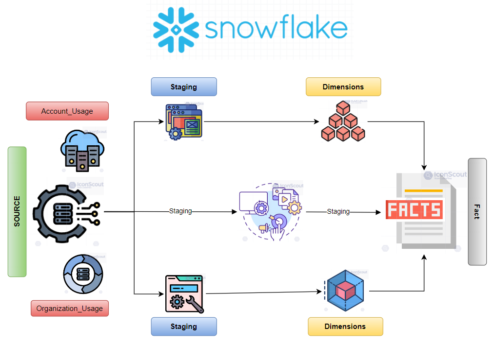
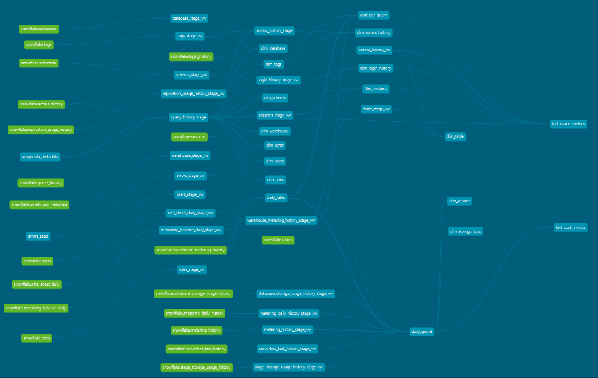

# Snowflake - Usage Data Analytics:


This snowflake usage analytics dbt project provides insights on the database / table level usage informations from snowflake.
This dbt project loads data from Snowflake Accounts Usage schema to create a Star Schema Dimensional model for Usage Analytics. The dbt models are created as incremental load into Staging & Views (dierctly of Snowflake Accounts Usage) and incremental loads into the datamart tables (dimensions and fact). 

Use this package to get insights into how, when and where your data is being used to make decisions that are more informed.


# Prequisites:

The main requirements for this project is

    - dbt (data build tool)
    - snowflake account
    - virtual environment

Once all the setup is done please follow the steps given below.

Create a python virtual environment and activate the env.

```
python -m venv <environment_name>
```
    
Once the evironment is created, install dbt.

```
pip install dbt-core
pip install dbt-snowflake
```
    
After dbt gets installed, make the connections established to the corresponding database using profiles.yml file. To establish the connection and configure profiles.yml file use the following command.

```
source ~/.dbt/profiles.yml
```

To test the connections are done, run the following command:

```
dbt debug 
```
    
Run the following command to install the dbt dependancies:

```bash
dbt deps
```

Grant dbt's role access to the `snowflake` database:

```sql
grant imported privileges on database snowflake to role <<your_dbt_role_name>>;
```

# List Of Tables Available In This Project:

    - Access_history
    - Database
    - Errors - (seed file is given)
    - Login_history
    - Query_history
    - Roles
    - Schemata
    - Sessions
    - Tables
    - Tags
    - Users
    - Warehouse


# Models And Datamart Of Snowflake Usage Analytics:



### Seeding:
This dbt project contains the seeding data for Error Codes and Description.

```bash
dbt seed --full-refresh
```

### Staging:

 Yaml files are created for all models available in staging folder and those yaml files contains column names, data type and description. Except for "query history" and "access history" all the other staging models in this project are created as views so that the data is refreshed automatically. All the source table names are defined as variables in dbt_project yaml file.


### Dimensions & Fact:

The dimensions are created/load using the incremental strategy. Yaml files are provided for all the models containing column description and tests.

### Star Schema ER model of the Data Mart:


### dbt project Lineage Graph:


## Credits

Previously, the Snowflake Usage Data analytics was intended to capture and analyze only the table level usage data.
Due to frequent client request, we have now added the Query Level Cost information to the Fact table.
We have used the logic (and code) created by the team at [SELECT](https://github.com/get-select/dbt-snowflake-monitoring) to derive the query level cost information.

### About:

##### The Snowflake Usage Data dbt project is developed by the dbt lovers from [Anjane Technologies](https://anjane.tech) & [Spark Data Analytics](https://www.sparkdataanalytics.com). 
